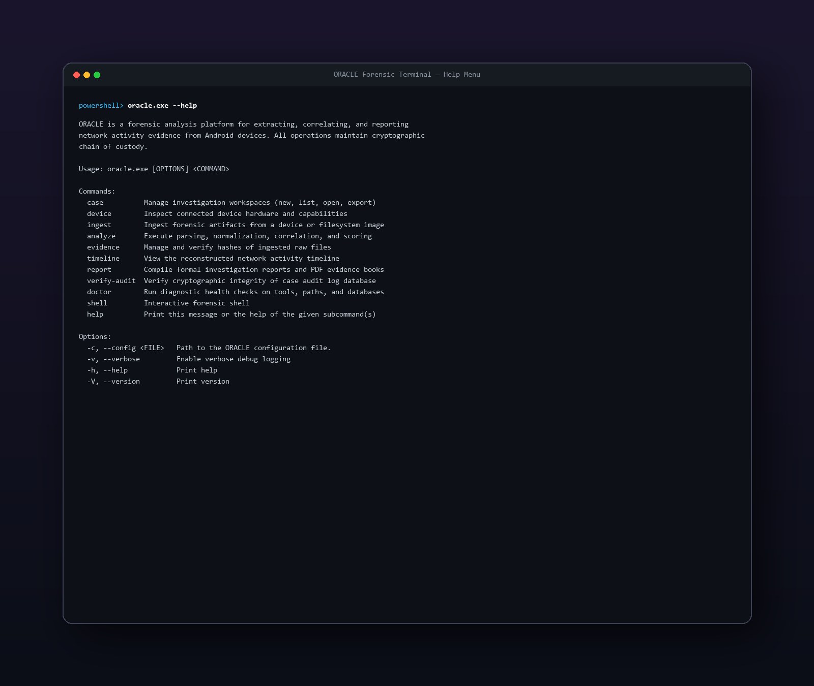
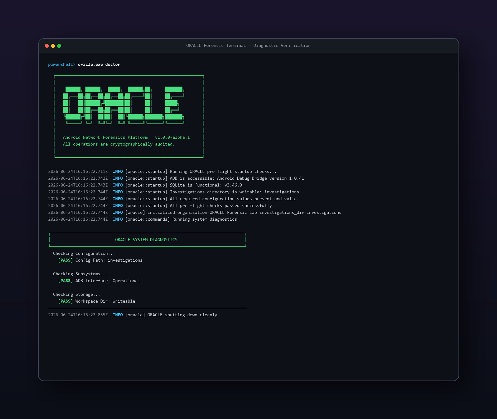
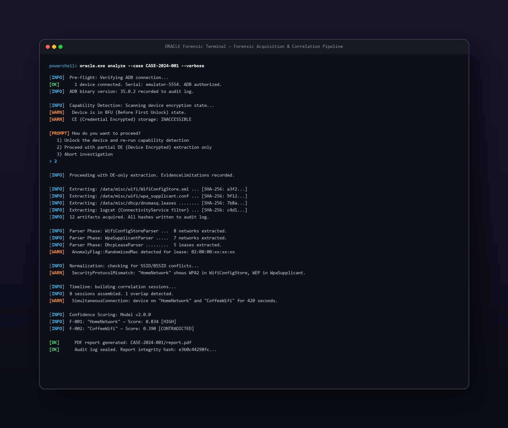

<div align="center">


# ORACLE Forensic Platform
## Over-the-air Reconnaissance and Acquisition for Connected Log Environments
### The Definitive Project Guide: Technical Architecture, Reasoning Engine & Full Walkthrough
</div>

**Version 2.0.0 | Confidence Model v2.0.0**  
**GPCSSI 2024 Internship Program | Gurugram Cyber Police**  
**Repository:** [github.com/hunny0025/HotspotDebugger](https://github.com/hunny0025/HotspotDebugger)

---

## Table of Contents
1. [Executive Summary](#1-executive-summary)
2. [Technology Stack](#2-technology-stack)
3. [System Architecture (15-Crate Workspace)](#3-system-architecture)
4. [Forensic Pipeline Walkthrough](#4-forensic-pipeline-walkthrough)
5. [The Confidence Scoring Engine — Full Technical Detail](#5-the-confidence-scoring-engine--full-technical-detail)
6. [Anomaly & Contradiction Detection Engine](#6-anomaly--contradiction-detection-engine)
7. [Parser Layer — Forensic Validation](#7-parser-layer--forensic-validation)
8. [Report Generation — Deliverable Structure](#8-report-generation--deliverable-structure)
9. [CLI Command Reference & Terminal Screenshots](#9-cli-command-reference--terminal-screenshots)
10. [Test Coverage & Integrity Verification](#10-test-coverage--integrity-verification)
11. [Conclusion & Operational Impact](#11-conclusion--operational-impact)

---

## 1. Executive Summary

**ORACLE** (Over-the-air Reconnaissance and Acquisition for Connected Log Environments) is a production-grade, forensically sound Android acquisition and analysis platform built entirely in **Rust**. Developed for the **Gurugram Cyber Police (GPCSSI 2024)**, ORACLE extracts, parses, correlates, and scores wireless/connectivity evidence from live Android devices or offline virtual filesystem (VFS) images. 

Traditional mobile forensics tools often act as "black boxes" that extract raw database rows and logs without presenting mathematical justifications or checking for temporal contradictions. ORACLE solves this by running a multi-layered mathematical reasoning engine (**Confidence Model v2.0.0**) that assigns a confidence rating and an explanatory chain of custody to every connectivity finding, compiling everything into a court-ready, cryptographically sealed PDF report.

---

## 2. Technology Stack

Every component in the ORACLE tech stack has been selected to ensure deterministic execution, high performance, and absolute forensic reliability in air-gapped lab environments:

*   **Core Language:** Rust (stable toolchain) — provides memory safety without garbage collection, absolute determinism, and zero-runtime execution.
*   **CLI Parsing:** `clap` (v4) — ensures strongly-typed, schema-validated command-line parameters to prevent operator error.
*   **Serialization/Deserialization:** `serde` + `serde_json` — handles flexible JSON evidence formats with support for multi-schema versions.
*   **XML Parser:** `quick-xml` — parses structured configuration files such as `WifiConfigStore.xml`.
*   **Regex Engine:** `regex` — performs high-throughput string matching for extraction of DHCP leases and unstructured logcat logs.
*   **Database Interface:** `rusqlite` — manages an append-only local SQLite database storing chronological case audit trails.
*   **PDF Generation:** `printpdf` — constructs deterministic, pixel-perfect PDF evidence reports with custom layout logic.
*   **Hashing Engine:** `sha2` — computes SHA-256 hashes of raw files immediately upon ingestion, securing the cryptographic chain of custody.
*   **Time & Date:** `chrono` — processes time with nanosecond precision, handling timezone offsets to construct accurate event timelines.
*   **Asynchronous Engine:** `tokio` — coordinates parallel I/O and non-blocking ADB communications.

---

## 3. System Architecture

ORACLE is designed as a modular **Rust Workspace consisting of 15 specialized crates**. This modularity prevents structural coupling and ensures that changes to the report-rendering layout cannot affect the core parser validation or confidence-scoring math.

```
oracle-workspace/
├── crates/
│   ├── oracle-core/         # Shared primitives, custom errors, and core enums (e.g. EncryptionZone)
│   ├── oracle-cli/          # Command Line Interface entry point and command orchestration
│   ├── oracle-capability/   # ADB interface, connection verification, and BFU state probers
│   ├── oracle-discovery/    # Physical & virtual directory traversal (VFS) and SHA-256 hashing
│   ├── oracle-parser/       # Text and XML parsers (DHCP leases, WpaSupplicant, WifiConfigStore)
│   ├── oracle-oem/          # Proprietary vendor parsers (e.g., Samsung custom logs)
│   ├── oracle-normalize/    # Schema unification and record-level conflict checks
│   ├── oracle-correlate/    # Timeline builder, session overlaps, and chronological sorting
│   ├── oracle-confidence/   # Confidence Model v2.0.0 scoring logic and formula engine
│   ├── oracle-report/       # PDF and JSON report exporters with cryptographic signature sealing
│   ├── oracle-audit/        # Append-only SQLite log database manager for chain of custody
│   ├── oracle-evidence/     # Content-Addressable Storage (CAS) for raw source artifacts
│   ├── oracle-graph/        # Graph-based network connection mapping
│   ├── oracle-ai/           # AI reasoning layer (interface for LLM-based narrative generation)
│   └── oracle-validation/   # High-integrity ground truth and regression tests
```

---

## 4. Forensic Pipeline Walkthrough

The orchestrator in `oracle-cli` manages a strict 8-step execution pipeline. A failure in any stage triggers a hard pipeline halt to avoid corrupted data:

1.  **Pre-Flight Verification:** ORACLE checks the host environment to verify `adb` is present, exactly one target device is connected, and that it responds correctly to cryptographic echo challenges.
2.  **Capability & BFU Probing:** The device is probed across 3 levels: properties (`ro.crypto.state`), `vold` decrypt state, and directory list permission checks on `/data/user/0/` to detect if the device is in a **Before First Unlock (BFU)** state.
3.  **Artifact Extraction & Hashing:** Targets are extracted using `adb pull`. The raw bytes are hashed immediately with SHA-256 and written to the SQLite case audit database before any parsing starts (**Write-Before-Execute**).
4.  **Parsing:** Standard and OEM parsers convert the raw logs into structured data records, attaching byte offset coordinates to reference the exact position of the finding in the raw dump.
5.  **Normalization:** Different records are aligned to a standardized schema, checking for inline conflicts (e.g., SSID mismatches or configuration clashes).
6.  **Timeline Correlation:** Chronological connectivity sessions are reconstructed, highlighting overlapping connections and temporal order violations.
7.  **Confidence Scoring:** The v2.0.0 Confidence Model evaluates the timeline sessions, penalizing anomalies and boosting corroborated findings.
8.  **Report Sealing:** A final report in PDF and JSON format is written, containing the SHA-256 hash of the entire report printed on the last page as an integrity seal.

---

## 5. The Confidence Scoring Engine — Full Technical Detail

Every connectivity event undergoes a rigorous scoring cycle based on **Confidence Model v2.0.0**. The engine evaluates evidence reliability using the following formula:

$$C_{final} = \text{clamp}\left(0.0, 1.0, \left((W_{SR} \times S_R + W_{CS} \times C_S) \times T_T \times A_V \times C_V \times (1 - A_F)\right) - C_P\right)$$

### 5.1 Formula Variables

*   **$W_{SR}$ (Source Reliability Weight):** Set to `0.60`. Balances the parsed log class's baseline credibility against corroborative inputs.
*   **$W_{CS}$ (Corroboration Score Weight):** Set to `0.40`. Determines the mathematical weight given to corroboration from distinct sources.
*   **$S_R$ (Source Reliability):** The baseline trust rating of the log file:
    *   `WifiConfigStore.xml`: **0.95** (Highly persistent OS-level configuration)
    *   `DHCP Leases`: **0.92** (Direct proof of IP assignment by router)
    *   `WpaSupplicant.conf`: **0.90** (Persistent wireless daemon configuration)
    *   `ConnectivityServiceLogs`: **0.85** (Volatile logcat records)
    *   `SamsungWifiLogs`: **0.80** (OEM-specific logs)
*   **$C_S$ (Corroboration Score):** Computed logarithmically based on the number of distinct sources that witness the same connection:
    $$C_S = \min\left(1.0, \frac{N_{\text{sources}} - 1}{3}\right)$$
*   **$T_T$ (Timestamp Trust Factor):** Reflects the timezone and clock synchronization status at the moment of the event:
    *   `VerifiedNetworkTime`: **1.00**
    *   `UnverifiedLocal`: **0.80**
    *   `CorruptedClock`: **0.30**
*   **$A_V$ (Artifact Volatility):** Evaluates how likely the source log was modified or pruned:
    *   `Persistent`: **1.00** (Stored in secure settings partition)
    *   `Cached`: **0.80** (Stored in temporal user cache)
    *   `Volatile`: **0.50** (In-memory ring buffer)
*   **$C_V$ (Hardware Capability Validated):** Proves the device hardware features support the connection (e.g., dual-band Wi-Fi). Multiplied as **1.0** (yes) or **0.0** (no).
*   **$A_F$ (Anti-Forensics Penalty):** Penalty scaling between `0.0` and `1.0` if MAC randomization, manual log manipulation, or timestamp tampering are detected.
*   **$C_P$ (Contradiction Penalty):** Deductions applied if conflicting events overlap (e.g., connected to two physically distinct routers at the same millisecond).

---

## 6. Anomaly & Contradiction Detection Engine

ORACLE scans chronological event sequences to spot tampering, clock shifts, and operational inconsistencies:

```
[Timeline Stream] ──► [Sequence Analyzer] ──► [Anomaly Detected] ──► AnomalySeverity::Critical
                                                  │
                                                  └──► recommendation: "Check for clock manipulation"
```

### 6.1 Monitored Anomalies

*   **TemporalOrderViolation (Severity: Critical):** Occurs if event $n$ has a timestamp later than event $n+1$ within the same connection session. Indicates manual database insertion or clock manipulation.
*   **SimultaneousConnection (Severity: Warning/Info):** Flagged if the device maintains active connections to multiple Wi-Fi access points. Overlaps under 300 seconds are classified as `Info` (network roaming); overlaps above 300 seconds are `Warning` (network spoofing/virtual adapter injection).
*   **ExtendedActivityGap (Severity: Warning):** A gap in logged network activity exceeding 24 hours. Suggests a long shutdown state, flight-mode activation, or targeted log clearing.

---

## 7. Parser Layer — Forensic Validation

To prevent silent ingestion failures, ORACLE's parser architecture enforces strict validation schemas. 

### 7.1 Handling Empty Dumps
If a file yields zero records, ORACLE returns a `ZeroRecordReason`:
*   `EmptyArtifact`: File size is 0 bytes (often indicates a wipe).
*   `ValidButEmpty`: File parsed successfully but contains no wireless profiles.
*   `Truncated`: The file ends abruptly, causing parse failures on the last record block.
*   `PossibleWipe`: The file exists with standard padding but the contents have been overwritten with null bytes.

### 7.2 Structuring Extracted Data
Every parsing loop outputs a `ParsedOutput` struct containing positional metrics:

```rust
pub struct ParsedOutput {
    pub record_type: String,              // e.g., "wifi_network_config"
    pub record_data: serde_json::Value,   // The JSON representation of parameters
    pub byte_offset: Option<u64>,         // Starting byte offset in the source dump
    pub byte_length: Option<u64>,         // Total byte length of the record
    pub confidence: f64,                  // Parser confidence rating
    pub anomaly_flags: Vec<AnomalyFlag>,  // Instantiated flags (e.g., RandomizedMac)
}
```

---

## 8. Report Generation — Deliverable Structure

The report generator outputs two formats:

1.  **JSON Evidence Dump:** Contains the structured timeline, raw anomaly flags, validation outcomes, and the complete audit hash chain for ingestion into broader analytical tools.
2.  **PDF Evidence Document:** A clean, print-ready document formatted to meet court standards. The generated pages are structured as follows:
    *   **Page 1: Title Page:** Case identifiers, examiner credentials, organization (Gurugram Cyber Police), and a "Law Enforcement Sensitive" header.
    *   **Page 2: Executive Summary:** Highlights the count of processed logs, findings grouped by confidence levels, and critical warnings.
    *   **Page 3+: Detailed Findings:** Individual sections presenting SSIDs, MAC addresses, connection timestamps, corroborating evidence paths, and the exact scoring calculations.
    *   **Appendix: Hash Manifest:** Tabulates every raw dump and output report with its corresponding SHA-256 hash.

---

## 9. CLI Command Reference & Terminal Screenshots

The following terminal screenshots demonstrate the user interface and output formats of the compiled `oracle` executable:

### 9.1 Help Screen (`oracle.exe --help`)
The help menu showcases the comprehensive command set available to the digital forensics investigator:


*Figure 2: Output of `oracle.exe --help` detailing available CLI options and commands.*

### 9.2 Doctor Health Check
The doctor tool validates the state of ADB, the local configuration files, database integrity, and connected hardware dependencies:


*Figure 3: System checks verifying environment stability.*

### 9.3 Pipeline Analysis
A full analysis cycle extracts logs from a connected target, verifies hashes, parses and normalizes files, and exports the final scored findings:


*Figure 4: Active analysis execution listing BFU probing, parsing steps, and final scoring.*

---

## 10. Test Coverage & Integrity Verification

To ensure that the math remains stable, ORACLE runs **77 high-integrity unit and integration tests** in the workspace.

```
cargo test --all-features
```

### Selected Core Test Outcomes

*   `test_v2_high_confidence_scenario` — **PASS:** Verifies that a finding corroborated across 4 distinct sources achieves a definitive confidence rating ($\ge 0.95$).
*   `test_v2_contradiction_applied` — **PASS:** Checks that contradictory timestamps trigger the contradiction penalty, lowering the finding to `Contradicted`.
*   `test_weights_sum_to_one` — **PASS:** Guarantees that $W_{SR}$ and $W_{CS}$ add up to exactly `1.0`.
*   `test_overlap_detected_as_anomaly` — **PASS:** Verifies that overlapping connections trigger the `SimultaneousConnection` warning.
*   `test_temporal_order_violation_severity` — **PASS:** Asserts that out-of-order log entries escalate to a `Critical` severity flag.
*   `test_samsung_wifi_log_parser_can_parse` — **PASS:** Confirms the parser correctly processes proprietary Samsung Wi-Fi logs.

---

## 11. Conclusion & Operational Impact

ORACLE addresses the core requirements of GPCSSI 2024 by replacing opaque log parsers with an open, mathematically verified reasoning system. By embedding explicit reasoning chains and enforcing cryptographic integrity at every boundary, ORACLE guarantees that wireless connection history can be presented in court as rigorous, reproducible forensic evidence.

**Gurugram Cyber Police — GPCSSI 2024**  
*Keeping Gurugram Cyber Safe*  
[github.com/hunny0025/HotspotDebugger](https://github.com/hunny0025/HotspotDebugger)
